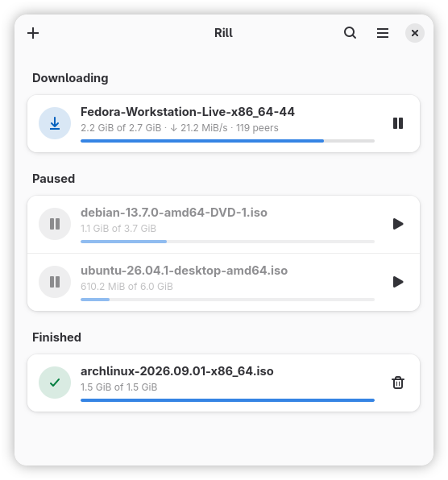

# Rill

Rill is a small BitTorrent client, written in Rust with GTK 4 and libadwaita on top of
[mtorrent](https://github.com/DanglingPointer/mtorrent). It needs GTK 4.20 and libadwaita
1.8.

Magnet links and .torrent files, added from the window, from the file manager or a
browser, or dropped on the window. Transfers are grouped into downloading, paused and
finished, ordered by when they were added, by name, by size or by how far along they are,
with a limit on how many download at once and the rest queued. A torrent's folder can be
changed after the fact, content and all. The details of a torrent show a map of the pieces
already on disk, its files, the peers it is connected to and its trackers, and switch it
to sequential downloading, so a video can be watched while it arrives. On desktops with a
system tray, closing the window leaves the transfers running in the background, and a
torrent that was downloading when Rill closed carries on the next time it starts.

  

## Limitations

Rill does not seed. A torrent shares pieces with other peers while it downloads, but stops
once it is complete. There are also no speed limits, no way to pick which files of a torrent
to download, and no way to recheck data already on disk. These are not supported yet.

## Packages

Fedora 44, 45 and Rawhide, from the Copr project
[sachesi/software](https://copr.fedorainfracloud.org/coprs/sachesi/software/):

    sudo dnf copr enable sachesi/software
    sudo dnf install rill

openSUSE Tumbleweed and Slowroll, from the OBS project
[home:sachesi:software](https://build.opensuse.org/project/show/home:sachesi:software); for
Slowroll the address has `openSUSE_Slowroll` in it, and on aarch64 `openSUSE_Factory_ARM`:

    sudo zypper addrepo https://download.opensuse.org/repositories/home:sachesi:software/openSUSE_Tumbleweed/home:sachesi:software.repo
    sudo zypper install rill

Debian testing, from the same OBS project; Ubuntu 26.04 has an older Rust than Rill
needs:

    sudo install -d /etc/apt/keyrings
    curl -fsSL https://download.opensuse.org/repositories/home:sachesi:software/Debian_Testing/Release.key | sudo gpg --dearmor -o /etc/apt/keyrings/sachesi-software.gpg
    echo 'deb [signed-by=/etc/apt/keyrings/sachesi-software.gpg] https://download.opensuse.org/repositories/home:sachesi:software/Debian_Testing/ /' | sudo tee /etc/apt/sources.list.d/sachesi-software.list
    sudo apt update
    sudo apt install rill

Arch Linux: the AUR package `rill-torrent`, built from
[packaging/aur/PKGBUILD](packaging/aur/PKGBUILD), which each release tag updates.

The same packages are attached to each [release](https://github.com/sachesi/rill/releases).

## Building and installing

    just build
    sudo just install        # or: just prefix=$HOME/.local build install

Build needs Rust 1.95, `blueprint-compiler`, `just`, gettext and the development packages
for GTK and libadwaita. Details, other prefixes and removal are in
[docs/installing.md](docs/installing.md).

## Documentation

- [Installing](docs/installing.md)
- [Using Rill](docs/usage.md)
- [Contributing](CONTRIBUTING.md), including where things are in the code, and
  [reporting a vulnerability](SECURITY.md)

The interface is available in English and Ukrainian.

GPL-3.0-or-later. The engine, [mtorrent](https://github.com/DanglingPointer/mtorrent), is
under the Apache License 2.0.
